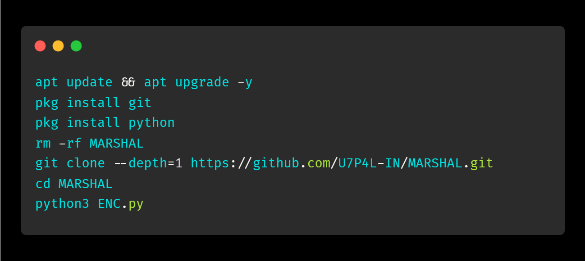
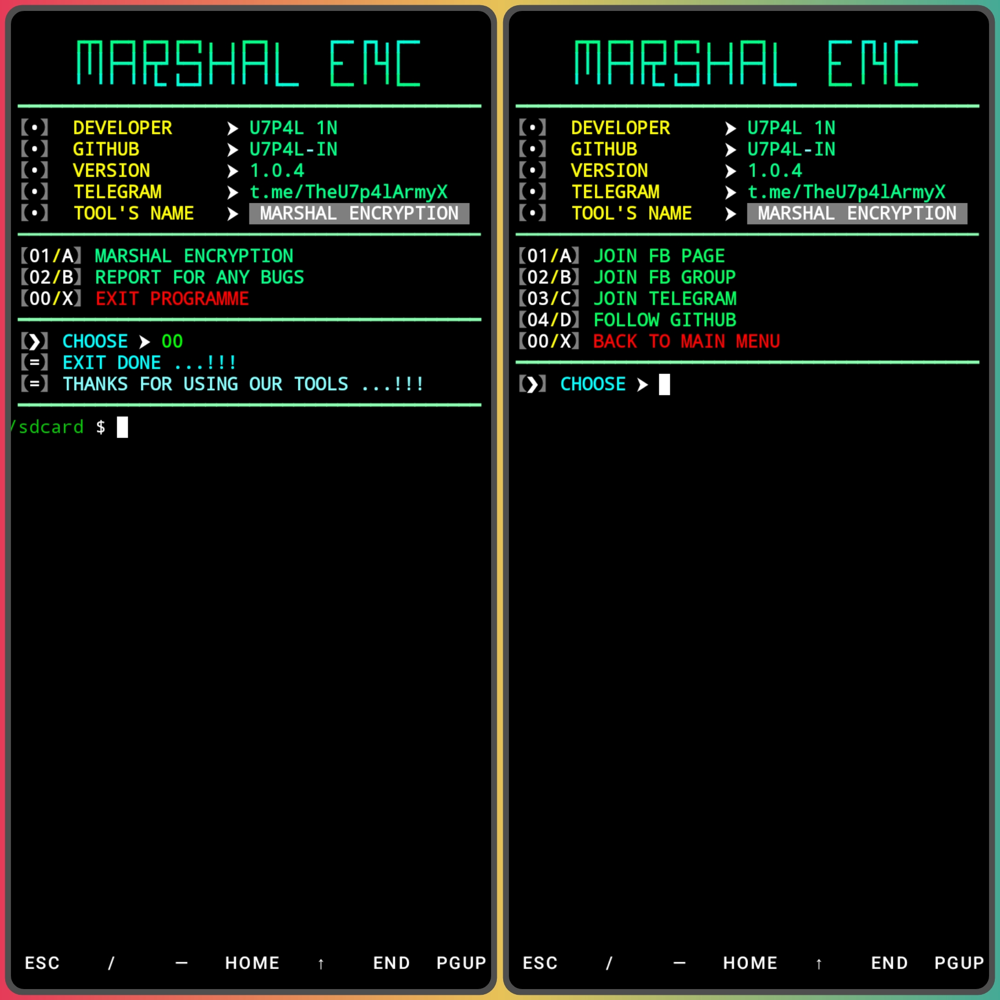
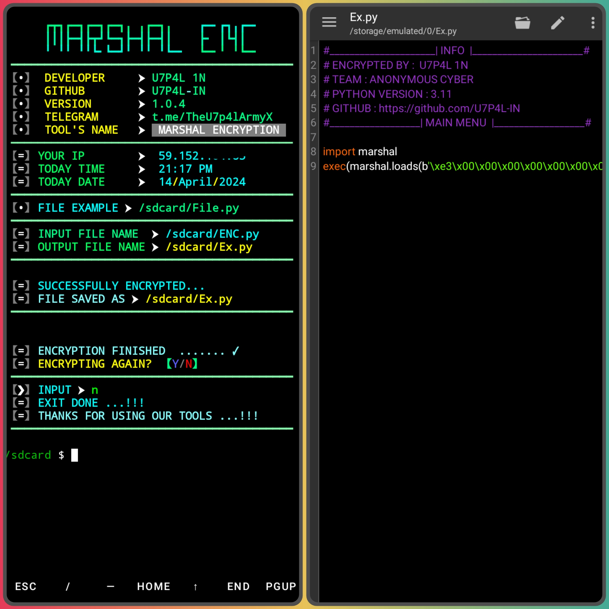
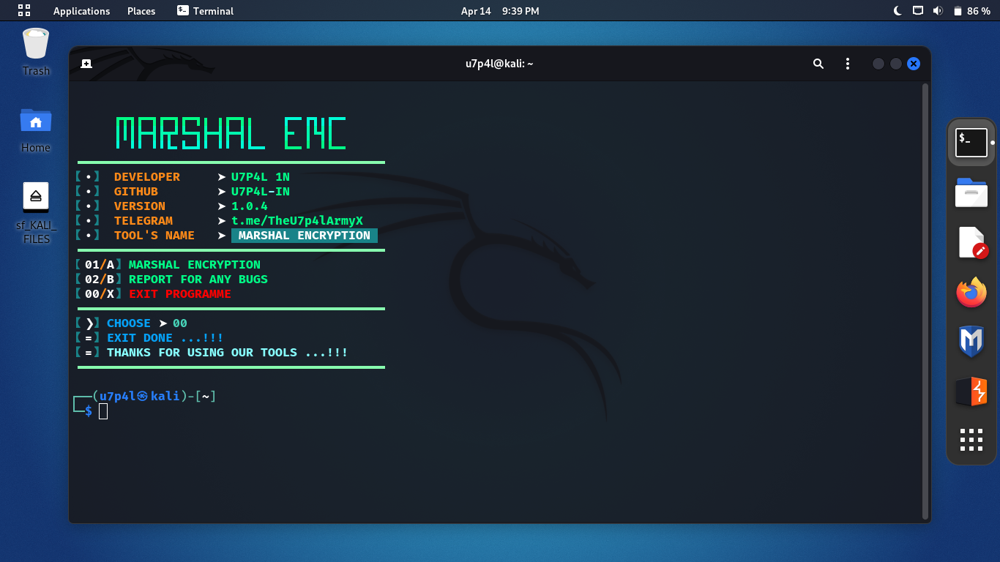
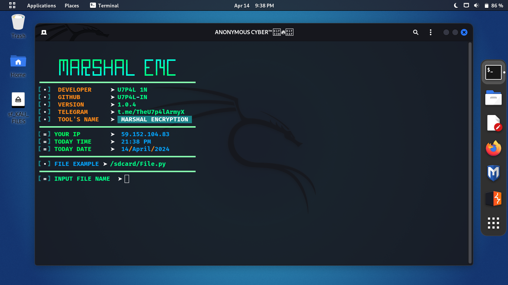
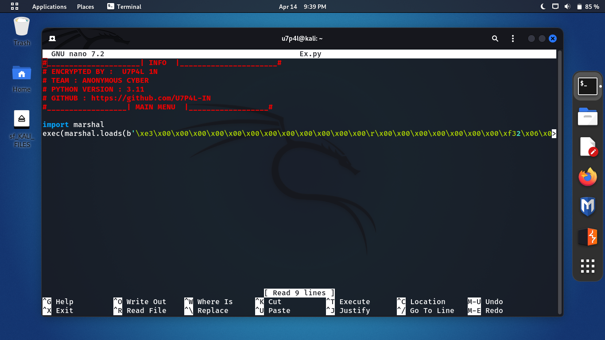

<p align="center">
</p>

</p>
   <p align="center">
      <a href="https://github.com/U7P4L-IN/MARSHAL/stargazers">
      </a>
      <a href="https://github.com/U7P4L-IN/MARSHAL/releases/latest">
      </a>
      <a href="https://www.conventionalcommits.org/en/v1.0.0/">
      </a>
      <a href="https://github.com/U7P4L-IN/MARSHAL/actions/workflows/github-action.yml">
      </a>
   </p>
   
</br>
<p align="center">

>Encryption is used to protect data from being stolen, changed, or compromised and works by scrambling data into a secret code that can only be unlocked with a unique digital key.

### Purpose and Format:
 - The marshal module is specific to Python and is used mainly for reading and writing the “pseudo-compiled” code found in Python modules (such as .pyc files).
 - It’s not a general persistence module; for more general persistence and object transfer, consider using the pickle and shelve modules.
 - The format used by marshal is intentionally undocumented and may change between Python versions, although it rarely does.
 - It’s not intended to be secure against erroneous or malicious data. Never unmarshal data from an untrusted or unauthenticated source.

### Supported Types:

 - marshal supports the following Python object types >
 - Booleans, integers, floating-point numbers, complex numbers, strings, bytes, bytearrays, tuples, lists, sets, frozensets, dictionaries, and code objects.
 - Singletons like None, Ellipsis, and StopIteration can also be marshaled and unmarshaled.
 - Note that recursive lists, sets, and dictionaries cannot be written for format versions lower than 3.

</p>

> [FILE INPUT AND OUTPUT STYLE]  
```python
INPUT FILE NAME  : /sdcard/FILE-NAME.py
OUTPUT FILE NAME : /sdcard/FILE-NAME.py
```
  
#### INSTALL TOOL ON TERMUX
```python
apt update && apt upgrade -y
pkg install git
pkg install python
rm -rf MARSHAL
git clone --depth=1 https://github.com/U7P4L-IN/MARSHAL.git
cd MARSHAL
python3 ENC.py
```
<p align="center">

## Termux >

<p align="center">
<p align="center">

# Report bugs
If you notice issues while installing this tool or running this tool kindly mail to me at <a href="mailto: AnonyminHack5@protonmail.com">Gmail</a> or Open an issue via github.

### Requirements 
```
python-3
pip
Internet Connection
And some other python packages
``` 
[Python 3](https://www.python.org/downloads/)

<hr>

<h2 align="left">Install Requirements (on Linux) > </h2><br>

```python
>> apt-get install git python3 python3-pip python python-pip
```
<h2 align="left">Kali Linux/Ubuntu/Parrot os > </h2>

```python
sudo apt-get update && apt-get install git
git clone https://github.com/U7P4L-IN/MARSHAL.git
cd MARSHAL
ls
sudo python3 ENC.py
```
### Linux >

<p align="center">
<p align="center">

### Result >

<p align="center">

### Tools Languages :

<p align="center">

</p>

<br>

### Contributing
Feel Free To Clone This Project. For Major Changes, Please Open An Issue First To Discuss What You Would Like To Change Or Add, Thank You!!.

<h2 align="center">LICENSE</h2>

**Marshal Encryption** is released under the MIT license, which grants the following permissions:
- Commercial use
- Modification
- Distribution
- Patent use
- Private use

For more convoluted language, see the [LICENSE](/LICENSE).
</br>

<h5 align="center"><b>DESCRIPTION</b></h5>

* ©️ Copyright Message
>> Copyright © [2023-27] [U7P4L-IN]
>All rights reserved. This Python project, along with its code, documentation, and any associated files, is the intellectual property of ANONYMOUS CYBER. You may not reproduce, distribute, or modify the contents of this repository without explicit permission from the owner.
# Give A Star ⭐

> You can also give this repository a star to show more people and they can use this repository.